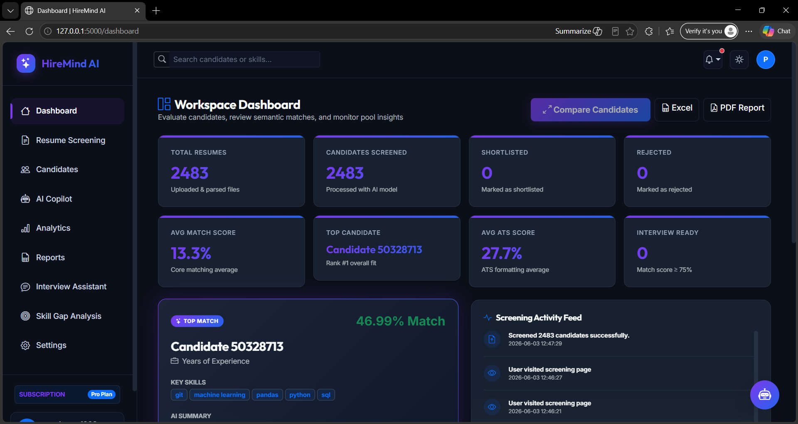
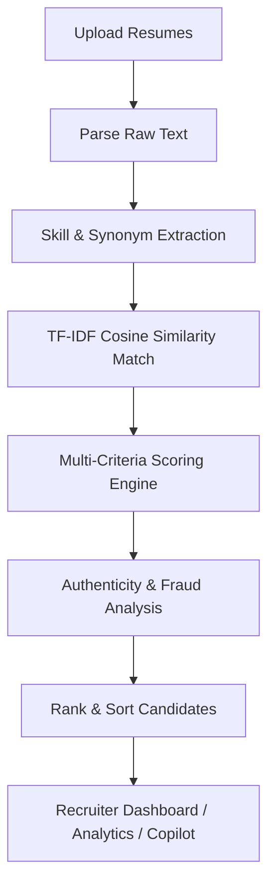

<p align="center">
  
</p>

<h1 align="center">🧠 HireMind AI — Intelligent Resume Screening & Recruitment Platform</h1>

<p align="center">
  <strong>Transforming recruitment with an enterprise-grade AI-powered resume screening pipeline, automated ATS compatibility checking, fraud detection, and explainable match diagnostics.</strong>
</p>

<p align="center">
  
  
  
  
  
</p>

---

## 📌 Overview

**HireMind AI** is a professional SaaS-level AI recruitment platform designed to help HR teams and hiring managers instantly parse, analyze, and rank candidate pools. By combining **TF-IDF semantic modeling**, custom **keyword & competency mapping**, and **chronological parsing heuristics**, the platform delivers deep candidate assessments, ATS alignment guidelines, and verification flags to streamline the hiring workflow.

---

## ✨ Features

### 🔍 Core Matching Engine & Security
- **Bulk Parsing Pipeline**: Drag & drop support for up to 100 files simultaneously (PDF, DOCX, CSV, TXT).
- **Hybrid Semantic Scorer**: Evaluates candidates across multiple criteria including skills match, years of experience, education, and project achievements.
- **Dynamic Score Tuning**: Interactive slider controls to customize weights per-role with presets for Tech-Heavy, Managerial, Balanced, or Internship roles.
- **Multi-User Data Isolation**: Robust logical database partitioning of candidate resumes, status changes, and weights presets history logs by `user_id`, preventing data leaks between recruiters.

### 🧠 Advanced AI Insights
- **Explainable AI Diagnostics**: Generates key candidate strengths, timeline gaps, and actionable feedback.
- **ATS Compatibility Audit**: Auto-calculates formatting scores, identifies parsing warnings, and offers concrete resume optimization tips.
- **Fraud & Stuffing Guard**: Scans for hidden keyword stuffing and highlights suspicious chronology claims (e.g. claiming experience on tech prior to its launch).
- **Success Predictor (Circular SVG Gauges)**: Computes and visualizes interview probability, selection likelihood, and overall role readiness using smooth, animated circular gauges.

### 💼 Recruiter Tools & Premium UI
- **8 KPI Cards Grid**: Displays dynamic counters for total resumes, screened candidates, shortlisted/rejected counts, averages, and readiness stats, backed by **count-up count animation**.
- **Top Candidate Hero Card**: Highlights the #1 ranked candidate profile, matching score, key skills, and experience with a glowing gradient border and a "Quick View" action.
- **Screening Activity Feed**: Renders recent log actions (e.g. "Resume Screened", "Report Exported", "Logged In") dynamically.
- **Vertical Milestones Timeline**: Chronological node timeline displaying candidate education, certifications, and achievements inside candidate preview.
- **Skill Proficiency progress bars**: Visual progress indicators representing matched skill competency strengths.
- **AI Workspace Copilot**: Chat with a virtual assistant using natural language search (e.g. "Show top python candidates") or voice commands to analyze and query the candidate pool.
- **Advanced side-by-side Candidate Comparison**: Compare up to 3 candidate profiles side-by-side across Match score, ATS score, experience, success probabilities, skills, and academic degrees.
- **Dedicated Analytics Dashboard**: Interactive graphs mapping required skills frequency, skill gaps, experience level pie charts, score bucketing, status breakdown, and a modern required skills tag cloud heatmap.
- **Interview Guide Generator**: Generates candidate-specific interview question sheets across technical, project, behavioral, and HR categories.
- **Reports Export**: Instantly download reports as Excel spreadsheets or PDF candidate summaries containing strengths, weaknesses, and interview questions.

---

## 🛠️ Tech Stack

- **Frontend**: HTML5, Vanilla CSS (Modern Dark Mode first, glassmorphism design), Vanilla JS, Chart.js, Bootstrap 5
- **Backend**: Python 3.10+, Flask
- **NLP / ML**: Scikit-Learn (TF-IDF Cosine Similarity), NLTK, Regex Parsers
- **Database**: SQLite 3
- **Containerization & Server**: Docker, Gunicorn

---

## 📂 Project Structure

Reorganized in a clean, production-grade architecture separating application logic, data pipelines, static assets, and dev tools:

```text
resume-ai/
├── app/
│   ├── routes/             # Controller blueprints
│   │   ├── auth.py         # Login, registration, session management
│   │   ├── screening.py    # Parsing, scoring, comparison, reports
│   │   └── analytics.py    # Aggregate metrics & chart API views
│   │
│   ├── services/           # Business logic & pipeline processors
│   │   ├── parser.py       # PDF/DOCX/TXT text extraction
│   │   ├── database.py     # SQLite connection & schema managers
│   │   ├── scorer.py       # Weighted scoring and rankings
│   │   ├── analytics.py    # Frequency maps and skill gap filters
│   │   ├── notifications.py# Email and Slack recruiters alert integration
│   │   └── resume_processor.py # End-to-end evaluation runner
│   │
│   ├── models/             # ML weights & classifier serialized files
│   │   └── resume_classifier.pkl
│   │
│   ├── database/           # DB files, schema script, and migrations
│   │   ├── database.db
│   │   └── schema.sql
│   │
│   ├── templates/          # Jinja2 HTML layouts & views
│   │   ├── base.html       # Sidebar menu shell & assets imports
│   │   ├── screening.html  # Upload & setup settings view
│   │   ├── dashboard.html  # Candidate tables, preview modals, workspaces
│   │   ├── analytics.html  # Talent pool charts
│   │   └── login.html      # Authentication layout
│   │
│   ├── static/             # Static frontend assets
│   │   ├── css/            # Style modules (app.css, dashboard.css)
│   │   └── js/             # UI scripting (theme.js, ai-advisor.js)
│   │
│   └── utils/              # General helper modules
│
├── data/                   # Structured data pipeline folders
│   ├── raw/                # Untouched raw CSV datasets
│   └── processed/          # Cleaned CSV data output
│
├── notebooks/              # Jupyter Notebooks workflows
│   ├── data_cleaning.ipynb
│   ├── eda.ipynb
│   └── model_training.ipynb
│
├── tests/                  # Pytest unit testing modules
├── screenshots/            # Visual previews for documentation
├── Dockerfile              # App container configuration
├── docker-compose.yml      # Multi-container orchestrator config
├── requirements.txt        # Pinned project requirements
├── config.py               # Env-backed configuration
├── app.py                  # Entrypoint script
└── README.md               # Project documentation
```

---

## ⚙️ How It Works



1. **Upload & Parse**: The platform extracts raw text from PDF/DOCX/TXT/CSV files in parallel.
2. **Skill Mapping**: Scans the text using synonym dictionaries to detect matching and missing competencies.
3. **Similarity Indexing**: Calculates TF-IDF vectors for the resume text and the job description, assessing semantic relevance via cosine similarity.
4. **Scoring Pipeline**: Evaluates candidate matches based on Keyword Coverage (40%), Semantic Alignment (35%), Education/Experience (15%), and Projects/Achievements (10%).
5. **Authenticity Guard**: Analyzes text for keyword stuffing, duplication, and flags impossible dates (e.g. 5 years of FastAPI experience starting in 2015).
6. **Insight Extraction**: Evaluates strengths, highlights weaknesses, scores ATS optimization parameters, and compiles custom interview guides.

---

## 🏗️ System Architecture

HireMind AI is built following a clean, decoupled **Layered SaaS Architecture** to separate user interactions, request routing, screening workflows, and relational storage.

```mermaid
graph TD
    subgraph Presentation Layer (Client)
        UI[Recruiter Dashboard & Templates] -->|HTTP / JSON Requests| API[Flask Web App Router]
        JS[theme.js / ai-advisor.js / dashboard.js] -->|APIs / SSE / Form Multipart| API
    end

    subgraph Controller & Routing Layer (Backend)
        API -->|Route Blueprints| AUTH[auth.py Blueprint]
        API -->|Route Blueprints| SCR[screening.py Blueprint]
        API -->|Route Blueprints| ANL[analytics.py Blueprint]
    end

    subgraph Services & Processing Layer (Business Logic)
        SCR -->|Invokes| RP[resume_processor.py Engine]
        RP -->|Concurrently Extracts| PARSER[parser.py PDF/DOCX/TXT Parser]
        RP -->|Extracts Skills & Synonyms| SE[skill_extractor.py synonym-matcher]
        RP -->|Computes Similarity Scores| SC[scorer.py TF-IDF Scorer]
        ANL -->|Aggregates Distributions| AS[analytics.py stats calculator]
        SCR -->|Funnels Alerts| NOTIFY[notifications.py email/slack alerts]
    end

    subgraph Storage & Relational Database Layer
        AUTH -->|Verifies Users| DB[database.py / SQLite db]
        SCR -->|Saves Candidates & Presets| DB
        ANL -->|Reads Logs & Fit Metrics| DB
    end
```

### Architectural Tiers

1. **Client / Presentation Layer**:
   - Modern, glassmorphic UI structured using Jinja2 HTML5 template fragments (`base.html`, `dashboard.html`, `analytics.html`).
   - Style variables managed dynamically through [app.css](file:///c:/Users/Nikhil/Documents/resume-ai/app/static/css/app.css) supporting native light/dark toggling.
   - Dynamic charts managed by client-side Chart.js instances.

2. **Controller & Blueprint Routing**:
   - Organized as independent Flask blueprints inside `/app/routes/` to cleanly decouple workspace functions, authentication controls, and data analytics.
   - Implements custom security filters (e.g. `@login_required`) to prevent unauthorized API requests.

3. **Core Processing Pipelines (Services)**:
   - **Text Extraction**: Uses parser libraries (PyPDF2, docx) to process resume raw text.
   - **Skill & Synonym Matcher**: Matches candidates using token match constraints and a synonyms database.
   - **TF-IDF Semantic Engine**: Converts job descriptions and resume text into relative tf-idf vector arrays to run cosine similarity computations.
   - **Data Validation & Fraud Guard**: Audits formatting structures and validates timeline assertions.

4. **Data Isolation & Storage**:
   - Manages relational constraints using SQLite.
   - Isolates candidate documents, weights presets, and system operations logs by `user_id` so that logged-in users are restricted to their own screening workspace.

---

## 🚀 Getting Started

### Prerequisites
- Python 3.10+ installed
- SQLite installed

### Local Setup

```bash
# 1. Clone the project repository
git clone https://github.com/payalmane1908/ai-resume-screening-system.git
cd ai-resume-screening-system

# 2. Setup the virtual environment
python -m venv .venv
source .venv/bin/activate       # On macOS/Linux
.venv\Scripts\activate          # On Windows

# 3. Install core requirements
pip install -r requirements.txt

# 4. Configure environment variables
copy .env.example .env          # On Windows
cp .env.example .env            # On macOS/Linux

# 5. Run the web server
python app.py
```

Open your browser and navigate to `http://127.0.0.1:5000` to register your HR workspace.

### Docker Deployment

To spin up the application in a sandboxed Docker container:

```bash
# Build and run the app
docker-compose up --build
```

---

## 🔌 API Endpoints

### Core App Views
- `GET /` — Screening upload & setup workspace.
- `GET /dashboard` — Recruiter workspace board with candidate lists, Copilot assistant, and interview guide.
- `GET /analytics` — Dedicated pool statistics page.
- `GET /login` / `/register` — Authentication views.

### Backend APIs
- `POST /api/screen` — Process uploaded resumes against a job description.
- `POST /update-status/<id>` — Modify review status of a candidate (Selected, Pending, Rejected).
- `GET /api/weights/history` — Load logs of recent weighted search presets.
- `POST /api/ai/chat` — Query the AI Copilot with natural language or transcripts.
- `GET /export/excel` / `GET /export/pdf` — Download candidate evaluation reports.

---

## 📸 Interface Preview

<p align="center">
  
  
</p>

---

## 🤝 Contributing

Contributions are welcome! Please review [CONTRIBUTING.md](CONTRIBUTING.md) to learn how to submit pull requests and log issue descriptions.

---

## 📄 License

This project is licensed under the MIT License — see the [LICENSE](LICENSE) file for more information.

---

## 👤 Author

**Payal Mane** — [GitHub Profile](https://github.com/payalmane1908)